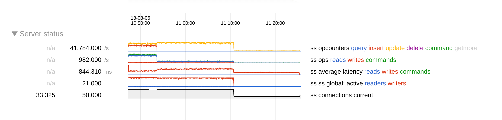

# Linkbench statistics

## LOAD phase

These are notes from reverse engineering for myself what the load phase does and what the statistics
mean. This is for the LinkStoreMongoDb, but should be true for any other store as well. (The example
output is for revision 00e7bb4f5e46be31f371964186a31ac613a13a1c in mongodb/mongo repo, but our perf
testing results aren't currently public.)

### What it does

The load phase loads all 3 collections in parallel. However, the nodetable is populated by a single
thread in order to generate a sequence of id1 values sequentially. So when we run with loaders=20,
the 20 threads are generating counttable and linktable, and 1 additional thread is generating
nodetable. This is why the csv table has 21 in the threads column, it is true.

The nodetable is populated with inserts while the linktable and counttable are upserts. Upserts are
updates in FTDC data. So we can now interpret the graph:

  

The red until 10:55:00 is inserts, so that's the thread filling the nodetable at about 25k
insert/sec. During this time there are about 33k updates/sec (yellow). At 11:10:47 all loader
threads except for Thread-0 have finished. That last thread continues until 11:25:20. Even if 15
minutes is a lot, this last thread is only responsible for 0.02 % of the total amount of links.
(...if we were to trust what it reports, which I don't necessarily do yet.) It must be some kind of
remainder from how the id1 space is split up. Obviously MongoDB is not saturated at this point
(average latency drops from 500ms to 200ms), rather the slowness must be inherent to the client.

### Understanding the results

When each thread finishes working it prints out its own statistics. The last line is:

    INFO 2018-08-06 11:10:47,449 [Thread-11]: 9997952/10000000 id1s loaded (100.0% complete) at 7043.75 id1s/sec avg. 39929251 links loaded at 28130.94 links/sec avg.

This can be misleading: Note that the nodetable has been populated a long time ago. The "id1s
loaded" stat refers to the id1 range for which this thread has created links and counts.

At the end, the main thread prints summary statistics. This line is straightforward to read: nr of
links / total time:

    INFO 2018-08-06 11:25:21,376 [main]: LOAD PHASE COMPLETED.  Loaded 10000000 nodes (Expected 10000000). Loaded 44118052 links (4.41 links per node).  Took 2293.3 seconds.  Links/second = 19238

Note that the throughput is only regarding links/second and ignores the parallel work that happened
to insert nodes and counts. Also note that the total time includes the 15 minutes from the last
straggling thread. So this statistic maybe tells something about linkbench, but does not say much
about mongodb writes/sec. We will continue to ignore it for MongoDB perf testing purposes.

The main thread also prints these statistics, which are the ones that are output also as CSV and
used by us in Evergreen graphs:

    INFO 2018-08-06 11:25:21,373 [main]: LOAD_NODE_BULK count = 9766  p25 = [10000,100000]ms  p50 = [10000,100000]ms  p75 = [10000,100000]ms  p95 = [10000,100000]ms  p99 = [10000,100000]ms  max = 187266.326ms  mean = 37250.397ms threads = 21
    INFO 2018-08-06 11:25:21,374 [main]: LOAD_LINKS_BULK count = 43093  p25 = [10000,100000]ms  p50 = [10000,100000]ms  p75 = [10000,100000]ms  p95 = [10000,100000]ms  p99 = [10000,100000]ms  max = 14466876.608ms  mean = 569744.311ms threads = 21
    INFO 2018-08-06 11:25:21,374 [main]: LOAD_COUNTS_BULK count = 11754  p25 = [10000,100000]ms  p50 = [10000,100000]ms  p75 = [10000,100000]ms  p95 = [10000,100000]ms  p99 = [10000,100000]ms  max = 760687.825ms  mean = 392135.426ms threads = 21

The mean is the mean response time for a bulk write = for the entire batch. We use 1024 documents /
batch. (The default for LinkStoreMongoDb.) Note however that the last batch for each thread is then
incomplete, and has less than 1024 docs. If my math is right, and work is distributed evenly to
begin with, in our case the last batch is 100M/20 mod 1024 = 288. So it's of course completing
faster, but the latency for this smaller bulk write is added to the mean just like any other. As
there are hundreds of 1024 sized batches per thread, this is an ignorable error.

LOAD_LINKS_BULK mean latency is 569744.311ms. This translates to 556 ms / document. This is
suspiciously slow, but the ftdc data seems to confirm that this is indeed the average latency for
writes. Possibly 1024 is too large value for batches here, especially as we have 21 parallel
threads.